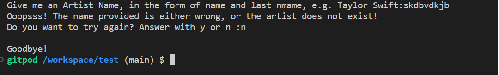

# Technical Assessment - Amuse
## Spotify Charts
### November 2022


This is a technical Assessment for the Junior Back end Developer role at Amuse. 

---
# Table of Contents
<details>
<summary>Table of Contents</summary>

* [Technical Assessment](#technical-assessment)
* [User Stories](#user-stories)
* [Agile Methodology](#agile-methodology)
* [Scope](#scope)
* [Technologies Used](#technologies-used)
* [Testing](#testing)
     
---

## Technical Assessment

Every day Spotify updates its API with data on the top charts around the world. Charts include Global, Viral, Regional, etc. This data is interesting for many reasons, and using software to parse and transform it can add a lot of value to services.

In the JSON file `global_weekly.json`, 200 entries from the global top chart are included, like the track name, artist name, and the number of streams for the period.

The task of the technical assessment is to create a script that allows a user to give an artist name, which then outputs the total number of streams for the artist in that chart.

Example of input file:
```
[    
     { "rank": "1", "artist_names": "Bizarrap, Quevedo", "streams": "30000", ... },
     { "rank": "2", "artist_names": "Taylor Swift", "streams": "24500", ... },
     { "rank": "3", "artist_names": "Drake, 21 Savage", "streams": "22000", ... },
     { "rank": "4", "artist_names": "Taylor Swift", "streams": "20000", ... },
     ...
]
```
and the artist name input: `Taylor Swift`

The expected output of `python chart_total.py "Taylor Swift"` would then be: 
```
{"artist_name": "Taylor Swift", "streams": 625100},
```

In addition, cases where problems might occur and how you can handle them to create a robust and scalable application should be considered.
---
## User Stories

### User Stories that have been satisfied by creation in this technical assessment:

| id  |  Content | How was it satisfied
| ------ | ------ | ------ |
|  [#1](https://github.com/van-essa/technical_assignment_amuse/issues/1) | As a user, I can type the artist's name to get the streams from the Spotify Charts data. | Input |
|  [#2](https://github.com/van-essa/technical_assignment_amuse/issues/2) | As a user, I can type the artist's name with lower, upper or mixed cases to get the streams from the Spotify Charts data. | Input |
|  [#3](https://github.com/van-essa/technical_assignment_amuse/issues/3) | As a user, I can choose to quit the script. | Input |
|  [#4](https://github.com/van-essa/technical_assignment_amuse/issues/4) | As a user, I can get the sum of artists' streams to get the total amount of streams from each artist in the Spotify Charts data. | Output |
|  [#5](https://github.com/van-essa/technical_assignment_amuse/issues/5) | As a user, I can get an error message to try again or exit the script when no artist exists, or the name is typed wrong. | Output |

---

## Agile Methodology

### Canban board and issues


Github issues were used to create the User stories and group them according to MoSCoW prioritization technique. Link to the project with live issues can be found [HERE](https://github.com/van-essa/technical_assignment_amuse/issues/).

---

## Scope

In order to achieve the desired user goals, a class **`SpotifyCharts`** was created so it can then fetch all the arguments from the JSON file and add them from the list in the SpotifyCharts class. Then when the user types the name of the artist, the program runs through the list, looks at the data and shares the sum of streams of the artist.

---

## Technologies Used

Several technologies have been used to enable this design to work:

| Technology  |  Content | 
| ------ | ------ |
|  [Python](https://www.python.org/) | Python is the core programming language used to write all of the code in this assesment to make it fully functional. |

---
## Testing
A manual testing has been used to ensure that the assignment's functionality meets the desired intent.

### Manual Testing

This project has been tested manually by the creator, Vanessa Andersson:

**As a user, I can type the artist's name to get the streams from the Spotify Charts data.**
!User Story 1](media/Name)

**As a user, I can type the artist's name with lower, upper or mixed cases to get the streams from the Spotify Charts data.**


**As a user, I can choose to quit the script.**


Or not:


Also, no matter how I type my answer it is accepted:


**As a user, I can get the sum of artists' streams to get the total amount of streams from each artist in the Spotify Charts data.**


**As a user, I can get an error message to try again or exit the script when no artist exists, or the name is typed wrong.**




Also, no matter how I type my answer it is accepted


